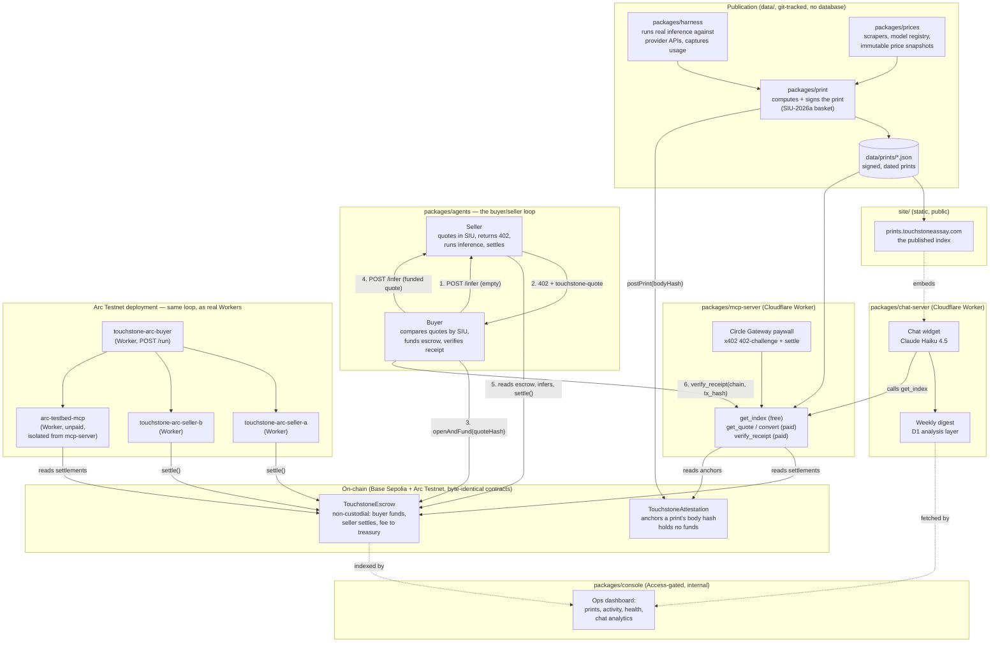

# Architecture

_One diagram of the whole system: how a print gets made and anchored, how an agent pays for
inference through the MCP server, and how the same buyer/seller loop now runs on Arc Testnet as
deployed Cloudflare Workers. Written for the ETHOnline 2026 submission's required architecture
diagram, and kept here as living repo documentation, not a one-off submission asset._

## Reading the diagram

- **Publication** (top-left) is entirely off-chain and file-based: a print is computed from real,
  executed inference runs and real price data, then signed and written to `data/prints/`. Nothing
  here ever touches a wallet.
- **Anchoring** is the only place publication meets the chain: a print's body hash is posted to
  `TouchstoneAttestation`, which holds no funds and exists purely so a print's signer can be
  proven against an on-chain, immutable `publisher()` address.
- **The paid rail** (`mcp-server`) is the one component that takes money: Circle's Gateway issues
  a real x402 402-challenge, a real agent pays, and only then does the request reach the actual
  tool. `get_index` is free by design — citation is the business model.
- **The buyer/seller loop** is the same protocol running in two shapes: locally as Node processes
  (`packages/agents`'s CLI demo, Base Sepolia) and as real, persistent Cloudflare Workers (Arc
  Testnet) — same `seller.ts`/`buyer.ts` logic underneath both.
- **Two chains, one set of contracts.** `TouchstoneEscrow`/`TouchstoneAttestation` are deployed
  byte-identical on Base Sepolia and Arc Testnet (`data/deployments/*.json`) — no chain-specific
  code exists in either contract, only in each chain's own deploy script.
